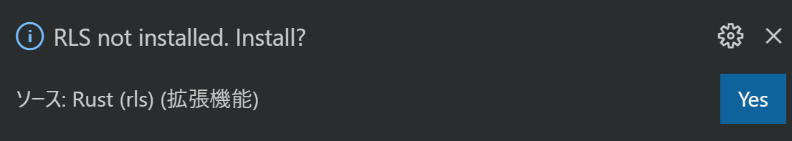
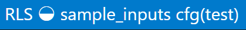

<!-- -*- coding:utf-8-unix -*- -->

# 利用するクレートの選択とコンパイル

**TODO** このページは書きかけです。

先にも軽く触れた通り、依存クレートのコンパイルにはそれなりの時間がかかります。コンテストが始まってから最初の問題の提出前に実行するとなるとそれなりのタイムロスになります。そこで次の二つのことをコンテスト開始前に行ってしまい、コンテスト開始後になるべくスムーズに行動できるよう準備しておきましょう。


## 利用するクレートの選択

これは事前準備時間を短くする、またはビルドディレクトリのディスク容量を減らすことに効果があります。

すべての依存クレートを有効化すると、スペックや環境にもよりますが、初回のコンパイルに数分かかるようになり、ビルドキャッシュも数百 MB (メガバイト) になります。ただし二回目以降のコンパイル時間やコンパイル後のバイナリの実行速度には影響しません。すなわち、競プロとして AtCoder 上で不利になるようなことはありません。したがって、最初にすべてのクレートを有効にしてしまったほうがコンテスト中の自由度は高くなります。このあたりのバランスはご自分のパソコンのリソースと相談して選択してください。


## 事前コンパイル

利用するクレートの選択を終えたら、次は事前コンパイルを行います。

(TODO: コマンド プロンプトまたは端末を開き、プロジェクトのあるフォルダまで移動する方法を説明する)

端末を開いてプロジェクトのあるフォルダまで移動したら、次のようにビルドを行います。

```console
$ cargo build
    Updating crates.io index
   Compiling proc-macro2 v0.4.30
   Compiling unicode-xid v0.1.0
   Compiling syn v0.15.39
   Compiling lazy_static v1.3.0
   Compiling quote v0.6.12
       :
       :
    Finished dev [unoptimized + debuginfo] target(s) in 20.27s
```

`Finished` の文字が見えたら、依存クレートのコンパイルは完了となります。

> Note: ここでは `cargo build` としてデバッグモードでのビルドを行いました。実際の AtCoder では `--release` オプションをつけて実行速度を最適化するのですが、これをつけるとさらにビルド時間が伸びてしまうことや、デバッガによるデバッグがしづらくなることなどのデメリットがあります。加えて、手元の環境ですることはサンプルケースレベルの比較的小さいサイズの入力を試す程度であることが多いため、速度を最適化する必要性もさほどないことが多いのではないでしょうか。一方、手元でもリリースビルドでテストすることがあるという方は、この段階で `cargo build --release` も加えて実行しておくことをおすすめします。そうでないとコンテスト中にリリースビルド用の依存クレートのコンパイルが行われ、多くの時間を取られてしまいます。


## (オプション) Rust Language Server の事前準備

> Note: この手順は Rust Language Server (RLS) を利用しない方は必要ありません。

RLS は `cargo build` とは別にキャッシュを持っており、初回起動時にキャッシュを作成します。したがって今の状態のプロジェクトは `cargo build` については十分高速に実行できますが、プロジェクトを開いてから補完などが機能するまでには時間がかかってしまうということです。したがって、このキャッシュについても今のうちに作っておくと、開いた直後から快適な編集ができます。


> Note: 最近は RLS の後継 (RLS 2) として開発されている Rust Analyzer という Language Server もあります。 [GitHub のリポジトリ](https://github.com/rust-analyzer/rust-analyzer)によればまだ開発段階とのことですが、以前に比べ機能も揃ってきています。不具合や課題もまだまだあるとはいえ、特にレスポンス面では Rust Language Server を超えている部分も多く見られます。この説明では正式版の RLS を採用しますが、導入方法もだんだんと整備されて簡単になっていますので、興味のある方はぜひお試しください。Visual Studio Code であれば拡張機能を一つインストールするだけです。

実際にキャッシュを作る方法は、単に今作成したプロジェクトを開くだけです。以下では Visual Studio Code の場合に説明しますが、他のエディタを利用する場合はそれに合わせて行ってください。

- プロジェクトを開きます。

    もし対応するバージョンの RLS がインストールされていない場合は、次のようなダイアログが右下に表示されます。ここで Yes を選択すれば自動的に RLS がインストールされます。

    

- ステータスバー左側の様子をチェックします。

    開いた当初は、くるくる回るインジケーターとともに Starting と表示されています。

    

    しばらくするとくるくる回りながらビルドが始まります。右側には現在ビルドしているクレートが表示されます。

    

    それが終わると、くるくる回るインジケーターが消えて RLS とだけ表示される状態になります。

    

    この状態になれば RLS の準備は完了です。
